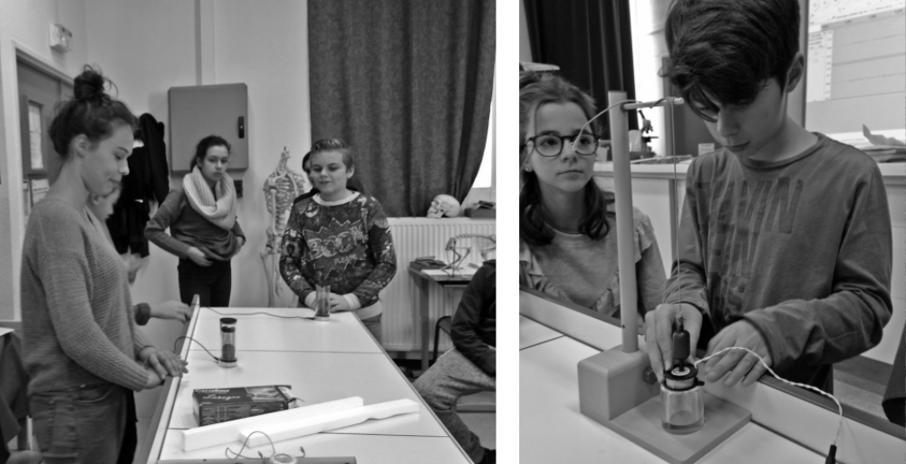
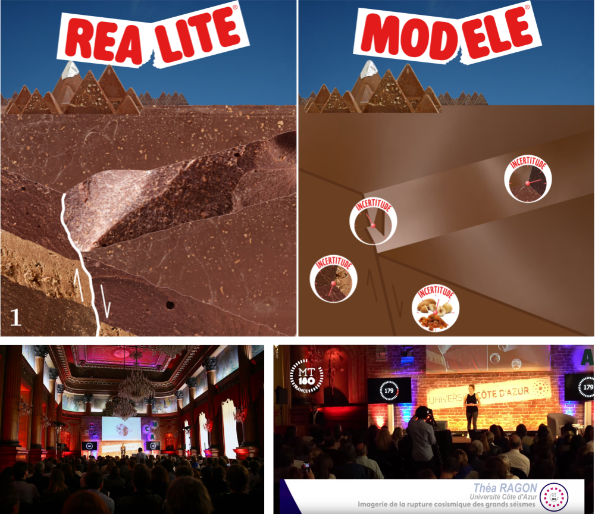

> I think fun experiments and good metaphors are worth a thousand words.
 
 
I have been involved in several outreach projects, or projects for education to scientific culture. Here are some excerpts.

{: .align-left}
#### Sismos à l'école
Part of the *Science in Schools*  education project, whose aim is to promote scientific culture in schools, by bringing scientific experiments, instruments and researchers to classrooms. I taught classes with fun experiments with pastas and soundmeters to explain earthquakes and seismic risks. I followed middle school students for cycles of 4 to 5 classes. Children loved to play with "earthquake-like" experiments, and having a female scientist in class conveyed a powerful message to students.

{: .align-right}
#### My PhD in 180 seconds
I presented uncertainties in our knowledge of earthquakes with a chocolate analogy. It worked so well I still use it!

